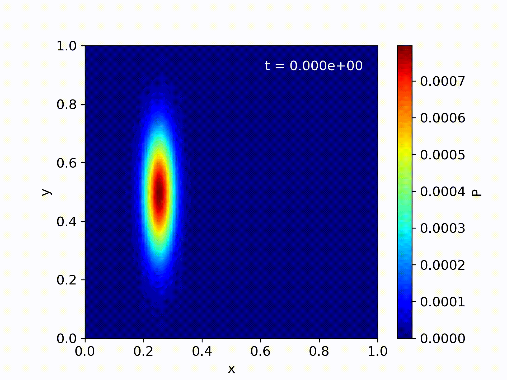

# Simulating time-dependent two dimensional Schrödinger equation
The Schrödinger equation is a fundamental equation in quantum mechanics that describes the time evolution of a quantum system. It is a partial differential equation that can be written in many different ways, but in the context of a two-dimensional system it takes the form:

$$i \hbar \frac{\partial \psi}{\partial t} = -\frac{\hbar^2}{2m} \left( \frac{\partial^2 \psi}{\partial x^2} + \frac{\partial^2 \psi}{\partial y^2} \right) + V(x,y,t) \psi(x,y,t)$$

where $\psi(x,y,t)$ is the wavefunction of the system, $i$ is the imaginary unit, $\hbar$ is the reduced Planck constant, $m$ is the mass of the particle, and $V(x,y,t)$ is the potential energy of the particle at position $(x,y)$ and time $t$.

We used the Crank-Nicolson method, which is a finite difference method that approximates the time derivative using a combination of forward and backward differences.

We will be using our simulation to study the double-slit experiment and other slit-configurations. 


## compile

 ```
 make compile
 ```
 
 ## Run
 Produce data for one problem at a time:
 ```
 make run_"problem"
 ```
where "problem" can be `P7_1`, `P7_2`, `P8`, `P9_single`, `P9_double` or `P9_triple`.

or simply produce all the data at once:

 ```
 make run_all
 ```
 
 ## plot
 
 For plotting run:
 
 ```
 python3 plot.py "problem"
 ```
 
 ## Animation
 
 We present animations produced from our simulation:
 ### Triple-slit configuration
 
